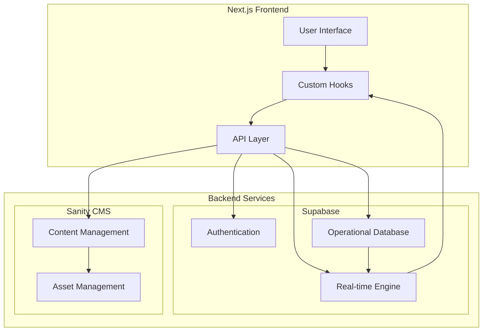

# Steplo

**Premium Lifestyle & Footwear Marketplace**

## **Day 3: Custom API Implementation & Data Migration**

### **1. Data Flow Architecture**



### **2. Data Migration & Integration Strategy**

#### **A. Supabase to Sanity Sync**

1. **Product Data Flow:**

```typescript
// 1. Fetch from Supabase
const fetchOperationalData = async () => {
  const { data: products } = await supabase
    .from('products')
    .select('*');
  return products;
};

// 2. Transform for Sanity
const transformForSanity = (product) => ({
  _type: 'product',
  name: product.name,
  slug: {
    _type: 'slug',
    current: product.slug
  },
  description: product.description,
  // ... other transformations
});

// 3. Push to Sanity
const syncToSanity = async (products) => {
  const client = sanityClient({...});
  const transaction = client.transaction();

  products.forEach(product => {
    transaction.createOrReplace(transformForSanity(product));
  });

  await transaction.commit();
};
```

2. **Real-time Sync:**

```typescript
// Subscribe to Supabase changes
const subscribeToChanges = () => {
  supabase
    .from("products")
    .on("*", (payload) => {
      handleDatabaseChange(payload);
    })
    .subscribe();
};

// Handle changes and sync to Sanity
const handleDatabaseChange = async (payload) => {
  const { eventType, new: newRecord, old: oldRecord } = payload;

  switch (eventType) {
    case "INSERT":
      await createInSanity(newRecord);
      break;
    case "UPDATE":
      await updateInSanity(newRecord);
      break;
    case "DELETE":
      await deleteInSanity(oldRecord);
      break;
  }
};
```

#### **B. Frontend Integration**

1. **Custom Hooks:**

```typescript
// Product Hook
export const useProduct = (slug: string) => {
  const [product, setProduct] = useState(null);
  const [loading, setLoading] = useState(true);

  useEffect(() => {
    const fetchProduct = async () => {
      // 1. Get rich content from Sanity
      const sanityProduct = await sanityClient.fetch(
        `*[_type == "product" && slug.current == $slug][0]`,
        { slug }
      );

      // 2. Get operational data from Supabase
      const { data: supabaseProduct } = await supabase
        .from("products")
        .select("*")
        .eq("slug", slug)
        .single();

      // 3. Merge data
      setProduct({
        ...sanityProduct,
        ...supabaseProduct,
      });
      setLoading(false);
    };

    fetchProduct();
  }, [slug]);

  return { product, loading };
};
```

2. **Real-time Updates:**

```typescript
export const useRealTimeStock = (productId: string) => {
  const [stock, setStock] = useState(null);

  useEffect(() => {
    // 1. Initial fetch
    const fetchStock = async () => {
      const { data } = await supabase
        .from("product_variants")
        .select("size, color, stock_level")
        .eq("product_id", productId);
      setStock(data);
    };

    fetchStock();

    // 2. Subscribe to changes
    const subscription = supabase
      .from(`product_variants:product_id=eq.${productId}`)
      .on("UPDATE", (payload) => {
        setStock((current) => ({
          ...current,
          [payload.new.id]: payload.new,
        }));
      })
      .subscribe();

    return () => {
      subscription.unsubscribe();
    };
  }, [productId]);

  return stock;
};
```

### **3. Implementation Steps**

1. **Setup Environment**

```bash
# .env.local
NEXT_PUBLIC_SUPABASE_URL=your_supabase_url
NEXT_PUBLIC_SUPABASE_ANON_KEY=your_supabase_key
SANITY_PROJECT_ID=your_sanity_project_id
SANITY_DATASET=your_dataset
SANITY_TOKEN=your_token
```

2. **Initialize Clients**

```typescript
// lib/supabase.ts
import { createClient } from "@supabase/supabase-js";

export const supabase = createClient(
  process.env.NEXT_PUBLIC_SUPABASE_URL!,
  process.env.NEXT_PUBLIC_SUPABASE_ANON_KEY!
);

// lib/sanity.ts
import { createClient } from "@sanity/client";

export const sanityClient = createClient({
  projectId: process.env.SANITY_PROJECT_ID,
  dataset: process.env.SANITY_DATASET,
  token: process.env.SANITY_TOKEN,
  useCdn: process.env.NODE_ENV === "production",
});
```

3. **API Routes Implementation**

```typescript
// pages/api/products/[id].ts
export default async function handler(req, res) {
  const { id } = req.query;

  try {
    // 1. Get operational data
    const { data: product } = await supabase
      .from("products")
      .select("*")
      .eq("id", id)
      .single();

    if (!product) {
      return res.status(404).json({ error: "Product not found" });
    }

    // 2. Get content data
    const sanityProduct = await sanityClient.fetch(
      `*[_type == "product" && references($id)][0]`,
      { id }
    );

    // 3. Merge and return
    res.status(200).json({
      ...product,
      content: sanityProduct,
    });
  } catch (error) {
    res.status(500).json({ error: "Failed to fetch product" });
  }
}
```

### **4. Data Migration Scripts**

1. **Initial Migration**

```typescript
// scripts/migrate.ts
import { supabase } from "../lib/supabase";
import { sanityClient } from "../lib/sanity";

async function migrateProducts() {
  // 1. Fetch all products from Supabase
  const { data: products } = await supabase.from("products").select("*");

  // 2. Transform and create in Sanity
  const transaction = sanityClient.transaction();

  products.forEach((product) => {
    transaction.createOrReplace({
      _type: "product",
      _id: `product-${product.id}`,
      name: product.name,
      slug: {
        _type: "slug",
        current: product.slug,
      },
      // ... other fields
    });
  });

  // 3. Commit transaction
  await transaction.commit();
}

migrateProducts();
```

### **5. Error Handling & Monitoring**

```typescript
// utils/error-handling.ts
export const handleApiError = (error: any) => {
  // Log to monitoring service
  logger.error({
    message: error.message,
    stack: error.stack,
    timestamp: new Date().toISOString(),
  });

  // Return user-friendly error
  return {
    message: "An error occurred",
    code: error.code || "UNKNOWN_ERROR",
  };
};
```

### **6. Testing Strategy**

1. **Unit Tests**

```typescript
// __tests__/api/products.test.ts
describe("Product API", () => {
  it("should fetch merged product data", async () => {
    const response = await fetch(`/api/products/${productId}`);
    const data = await response.json();

    expect(data).toHaveProperty("id");
    expect(data).toHaveProperty("content");
    expect(data.content).toHaveProperty("description");
  });
});
```

2. **Integration Tests**

```typescript
describe("Data Sync", () => {
  it("should sync Supabase changes to Sanity", async () => {
    // Create product in Supabase
    const { data: product } = await supabase
      .from("products")
      .insert(testProduct);

    // Wait for sync
    await new Promise((resolve) => setTimeout(resolve, 1000));

    // Verify in Sanity
    const sanityProduct = await sanityClient.fetch(
      `*[_type == "product" && _id == $id][0]`,
      { id: `product-${product.id}` }
    );

    expect(sanityProduct).toBeTruthy();
  });
});
```

---

_Created for NextJS Design JAM 2025 Hackathon - Day 3_
