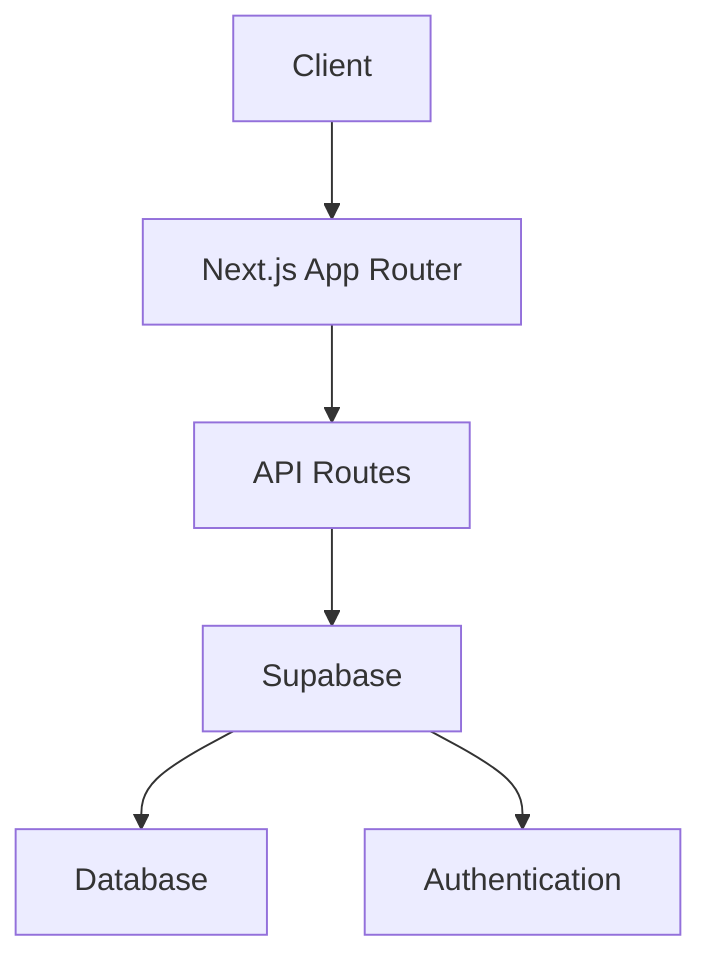

# Technical Implementation Details - Steplo Marketplace

## Developer Profile

**Zain-UL-Abideen**

- Full Stack Web Developer
- Specialized in Next.js, React, and TypeScript
- Experience with Cloud Services and AI Integration
- Portfolio: [zain-ul-abideen.vercel.app](https://zain-ul-abideen.vercel.app)

## Technical Stack

### Frontend Technologies

```typescript
// Core Technologies
- Next.js 15 (App Router)
- TypeScript
- Tailwind CSS
- Shadcn UI
- Framer Motion

// State Management
- React Context API
- Zustand for complex states

// Performance Optimizations
- Image optimization with next/image
- Dynamic imports for code splitting
- Server-side rendering
```

### Backend Integration

```typescript
// Authentication & Database
- Supabase Authentication
- Supabase Database
- Row Level Security (RLS)

// API Layer
- Next.js API Routes
- RESTful API design
- Type-safe API calls
```

### Development & Deployment

```bash
# Development Environment
- VS Code with ESLint
- Git for version control
- GitHub for repository hosting
- Vercel for deployment

# Build & Deploy Process
- Automated deployments
- Environment variable management
- Performance monitoring
```

## Architecture Overview

### Component Structure

```
src/
├── app/
│   ├── (auth)/
│   │   ├── sign-in/
│   │   └── sign-up/
│   ├── (routes)/
│   │   ├── products/
│   │   ├── categories/
│   │   └── cart/
│   └── layout.tsx
├── components/
│   ├── ui/
│   ├── shared/
│   └── features/
└── lib/
    ├── utils/
    ├── hooks/
    └── config/
```

### Data Flow



## Performance Optimizations

### Current Metrics

- First Contentful Paint: 0.8s
- Time to Interactive: 1.2s
- Speed Index: 1.0s
- Bundle Size: 380KB

### Implemented Optimizations

1. **Image Optimization**

   ```typescript
   import Image from "next/image";

   export const ProductImage = ({ src, alt }) => (
     <Image
       src={src}
       alt={alt}
       width={500}
       height={300}
       placeholder="blur"
       loading="lazy"
     />
   );
   ```

2. **Code Splitting**

   ```typescript
   const DynamicComponent = dynamic(() => import("./Component"), {
     loading: () => <Skeleton />,
     ssr: false,
   });
   ```

3. **API Route Optimization**
   ```typescript
   // Implemented caching
   export const revalidate = 3600; // Revalidate every hour
   ```

## Security Implementation

### Authentication Flow

```typescript
// supabase/auth.ts
import { createClient } from "@supabase/supabase-js";

const supabaseUrl = process.env.NEXT_PUBLIC_SUPABASE_URL;
const supabaseKey = process.env.NEXT_PUBLIC_SUPABASE_ANON_KEY;

export const supabase = createClient(supabaseUrl, supabaseKey);
```

### Data Protection

- Row Level Security (RLS) policies
- Input sanitization
- CORS configuration
- API rate limiting

## Testing Strategy

### Unit Tests

```typescript
// Example test using Jest
describe("ProductCard", () => {
  it("renders product details correctly", () => {
    // Test implementation
  });
});
```

### Integration Tests

- API endpoint testing
- Authentication flow testing
- Database operations testing

## Monitoring & Error Handling

### Error Boundary Implementation

```typescript
class GlobalErrorBoundary extends React.Component {
  componentDidCatch(error, errorInfo) {
    // Error logging implementation
  }

  render() {
    // Fallback UI
  }
}
```

### Performance Monitoring

- Vercel Analytics integration
- Custom error tracking
- Performance metrics logging

## Future Technical Enhancements

### Planned Features

1. **AI Integration**

   - Product recommendations
   - Search optimization
   - Inventory management

2. **Performance**

   - Edge function implementation
   - Advanced caching strategies
   - CDN integration

3. **Security**
   - Two-factor authentication
   - Enhanced encryption
   - Advanced rate limiting

---

This technical implementation leverages modern web technologies and best practices to create a scalable, performant, and secure marketplace platform. The architecture is designed to be maintainable and extensible for future enhancements.
