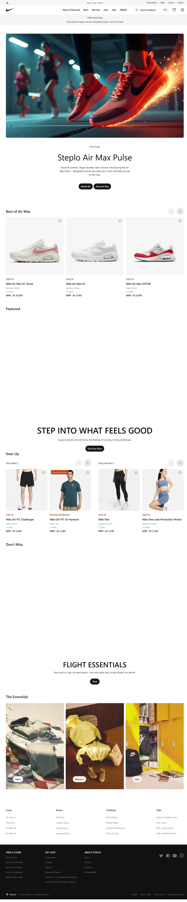
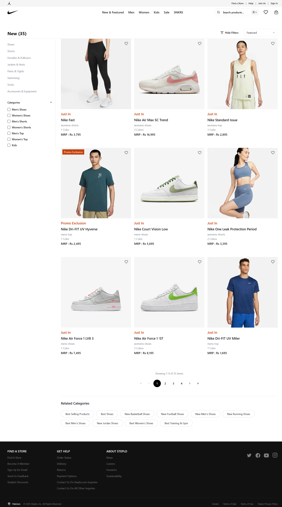
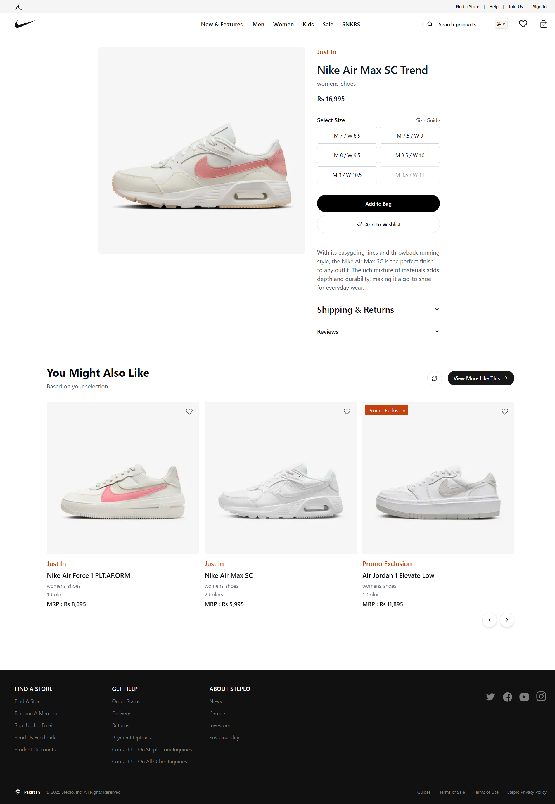
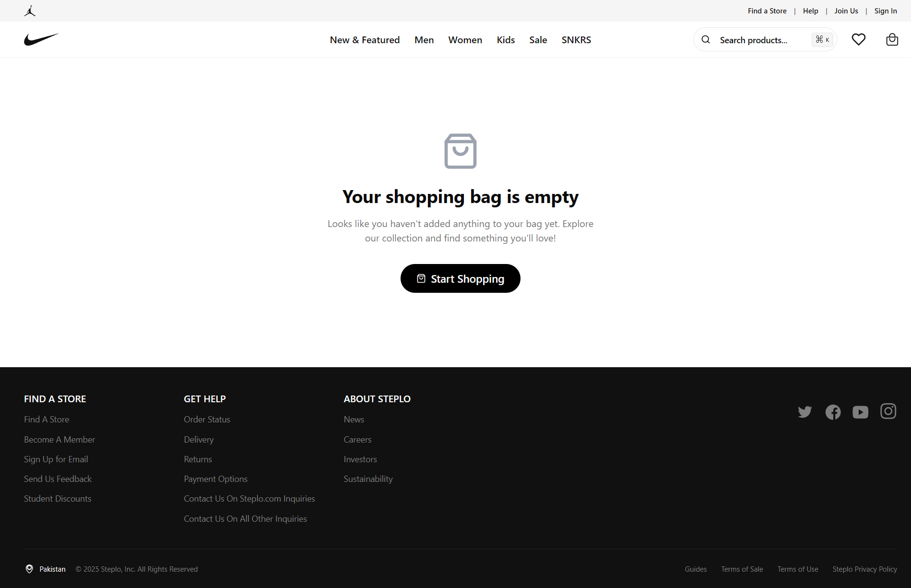
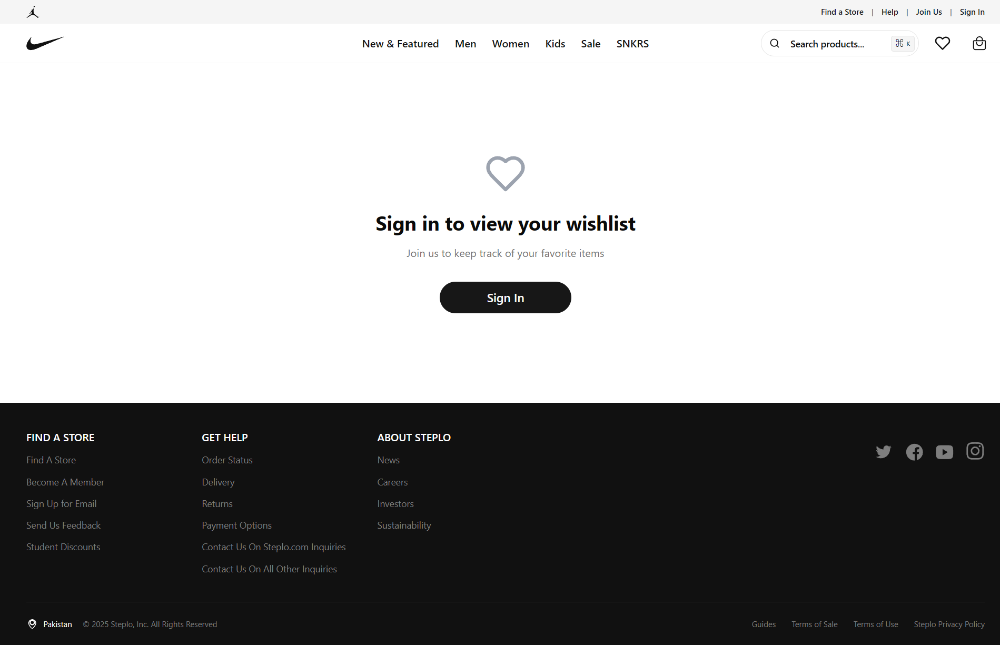
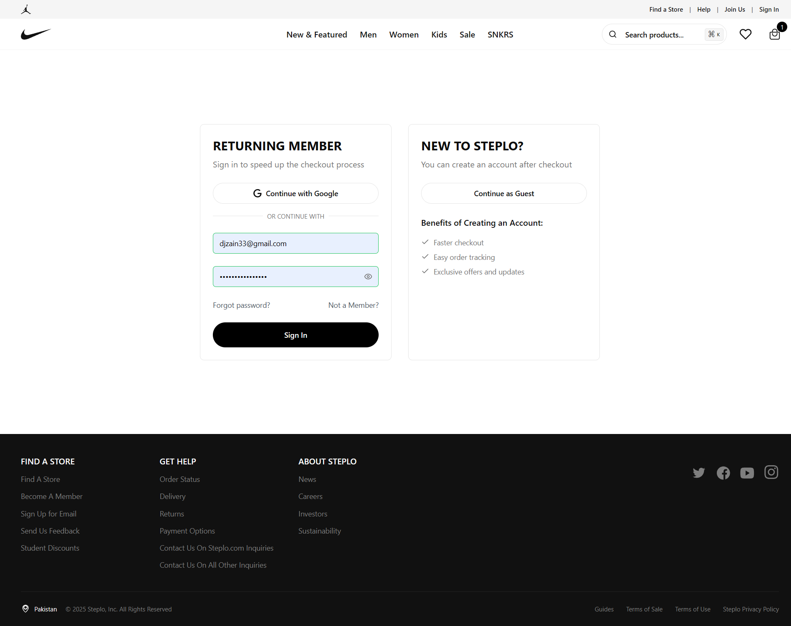
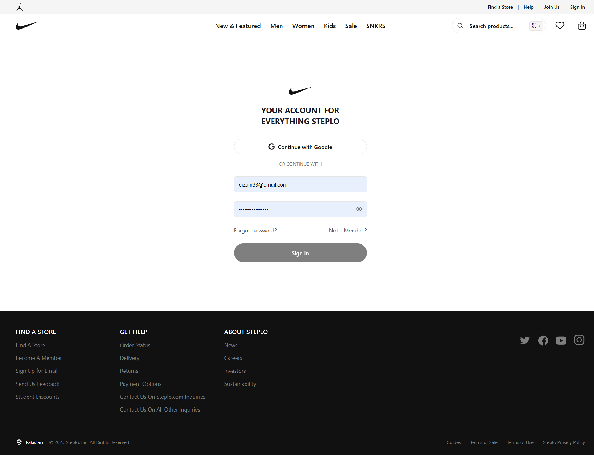
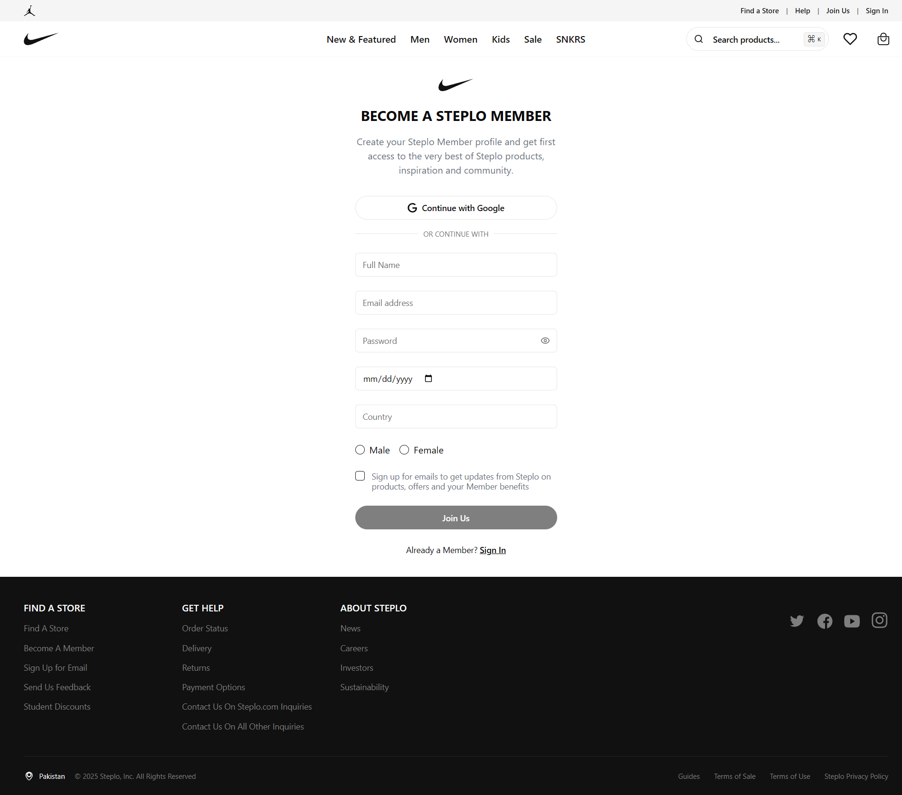
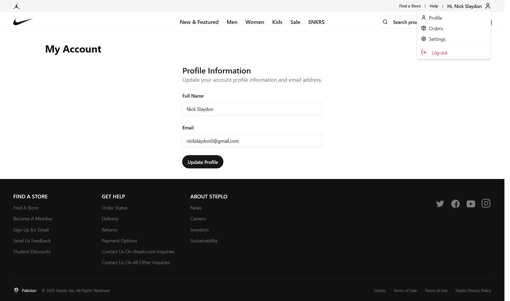
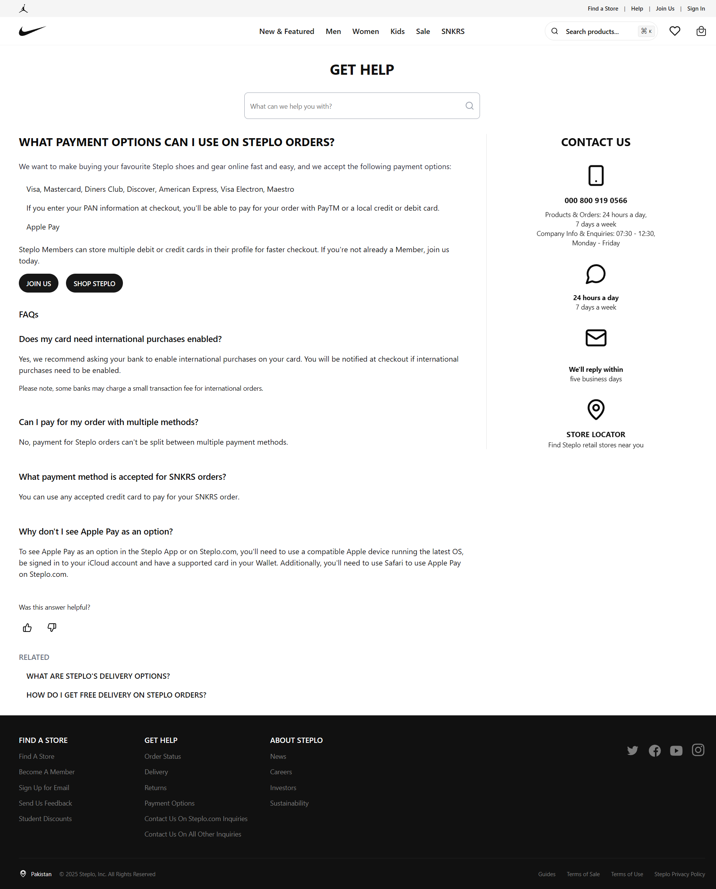

# Steplo Marketplace - Screenshots Gallery

This directory contains screenshots of various features and pages of the Steplo Marketplace application. Below is a categorized overview of the available screenshots.

## 🏠 Homepage


_Main landing page showcasing featured products and hero section_

## 🛍️ Product Pages

### Product Listings


_Product catalog with filtering and search options_

### Product Details


_Detailed product view with specifications and purchase options_

## 🛒 Shopping Experience

### Shopping Cart


_Cart page showing selected items and total_

### Wishlist


_Wishlist page displaying saved items_

### Checkout Process


_Initial checkout step_

.png>)
_Payment information step_

.png>)
_Order review step_

## 👤 User Account

### Authentication


_User login interface_


_New user registration page_

### User Profile


_User profile management_

### Order History


_Order history and tracking_

## 💁 Help & Support


_Help center and customer support_

## 📱 Responsive Design

The application is fully responsive and provides an optimal viewing experience across different devices:

- Desktop views (shown above)
- Tablet views
- Mobile views

## Image Specifications

- Format: PNG
- Resolution: High quality (varies by image)
- Total Screenshots: 28
- Categories Covered:
  - Homepage
  - Product Pages
  - Shopping Cart
  - Checkout Process
  - User Account
  - Help Center

## Usage Guidelines

These screenshots are for:

- Documentation purposes
- Feature demonstration
- UI/UX reference
- Marketing materials

## Directory Structure

```
Images/
├── Homepage/
│   └── steplo.vercel.app_.png
├── Products/
│   ├── listings/
│   └── details/
├── Shopping/
│   ├── cart/
│   └── checkout/
└── Account/
    ├── auth/
    └── profile/
```

---

_Note: All screenshots are captured from the live application deployed at [steplo.vercel.app](https://steplo.vercel.app/). Visit the live site to explore these features in action._
